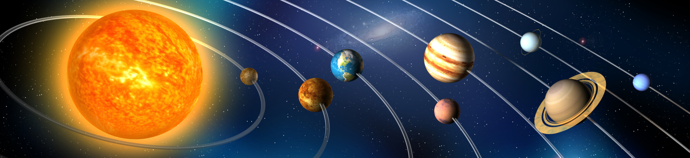
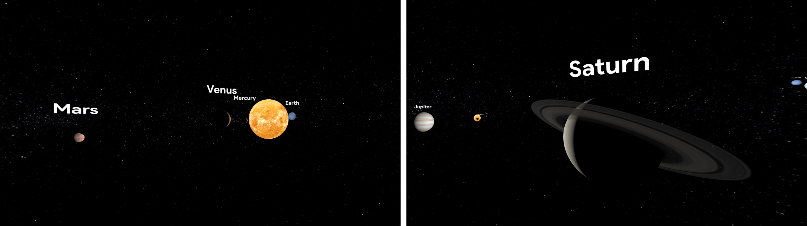
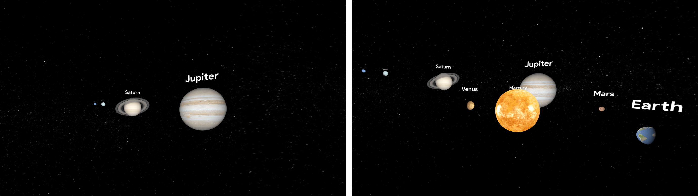

# Solar System 3D Simulator

## 📣 About

**Solar System 3D Simulator** (<https://solar-system.netsons.org>) is a web application developed using WebGL and THREE.js, designed to simulate the solar system in three dimensions. The application accurately represents the scale, dimensions, distances, orbital shapes, rotation, and revolution speeds of celestial bodies.

Currently in a developmental stage, this educational project aspires to depict the entire complexity of the solar system on screen.

## 💡 Authors
* [Alberto Boffi](https://github.com/albertoboffi): Software Development
* [Grecya D'Angiò](https://github.com/grecyadangio): Creative Lead
## 🦾 Usage
The application is accessible at the following [link](https://solar-system.netsons.org/).

To run it on localhost:
1. Make sure [Node.js](https://nodejs.org/en) in installed on your system.

2. Serve the page

       npx serve path/to/the/repo
       
3. Access the application through the url <http://localhost:3000>
## 🤝 Contributing
Pull requests are welcome. For major changes, please open an issue first to discuss the proposed changes.
## 🏁 Roadmap
The project is not final but still in the development phase. Listed [here](https://github.com/albertoboffi/solar-system-3d/blob/main/docs/TODO.md) are the most important features that are expected to be integrated.
## ⚖️ License
This project falls under the MIT license.